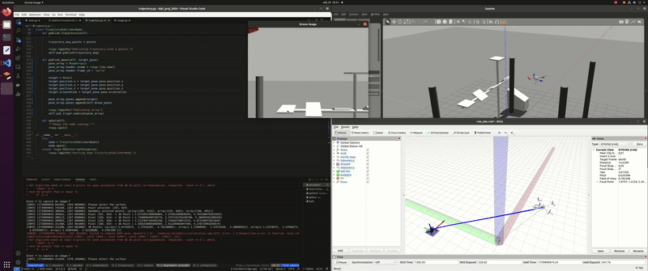

# Diplomski projekt 2024

Studenti: Fran Maric, Luka Vukelic, Josip Hanak

## Running

### Build
Docker build to build the docker image
    
    ./docker_build.sh
### Run
Docker run to start the docker container
    
    ./docker_run.sh
Inside container run the start script that will start the tmux session. This should start the gazebo simulator.
    
    ./startup/simulation/start.sh

### Run FastPerchingCustom project (private repo)    
# Final Project: Development of a System for Space Segmentation to Identify Key Points for UAV Grasping/Landing

## Project Description
This project focuses on developing a system for space segmentation to identify key points for safe UAV landing. The intrinsic camera parameters define how 3D points are projected onto a 2D image, which is crucial for the **Perspective-n-Point (PnP)** problem. Meanwhile, the **Gauss-Newton optimization** is used to iteratively adjust rotation and translation to minimize the error between predicted and actual 2D projections. The estimated target **6DOF** is then sent to a node in the **FastPerchingCustom** project, which is a modified version of the [FastPerching](https://github.com/ZJU-FAST-Lab/Fast-Perching) algorithm. There, a novel trajectory planning method is developed for real-time aerial descent, adaptively adjusting the final states and trajectory duration. This feature is particularly useful in scenarios with limited space. After computing the main trajectory points, they are sent to our base project, where the **TOPP-RA** algorithm directs the UAV along those points.

## Table of Contents
- [Key Point Segmentation](#key-point-segmentation)
- [Trajectory Planning](#trajectory-planning)
- [Simulation and Real Data](#simulation-and-real-data)

## Key Point Segmentation

### Identifying Key Points
- Data is received via **ROS topic**, triggering the UAV to stop movement.
- The user selects the landing surface.
- The **Segment-Anything Model (SAM)** is used for surface segmentation.

### Segmentation using the SAM Model
The **Meta AI transformer architecture** is used:
- **SAM_H**: 2.8 GB RAM, initialization time 40s, segmentation time 0.15s
- **SAM_B**: 1.3 GB RAM, initialization time 9s, segmentation time 0.21s
- **FAST_SAM**: 400 MB RAM, initialization time 0.2s, segmentation time 1.4s (lower accuracy)

### 6DOF Transformation
For trajectory calculation, the system requires:
- Conversion of 2D data into **3D coordinates** using **Structure from Motion (SfM)**.
- Data transformation using the **solvePnP algorithm**:
  - **Pinhole model**
  - **Perspective transformation**
  - **Rotation and translation in 3D space**

## Trajectory Planning

### TOPP-RA (Time Optimal Path Parameterization)
- Defining optimal speeds and accelerations.
- Two main methods are used:
  - **Numerical Integration (NI)** – a faster method
  - **Convex Optimization (CO)** – a more robust method

### Fast-Perching
- Final trajectory planning for **vertical or inclined surfaces**.
- **Bezier curves** for trajectory representation.
- Minimizing control stress using **MINCO optimization**.

## Simulation and Real Data

### Simulation
The simulation includes:
- **ROS UAV Stack**
- **Blender, Gazebo World**
- **Docker for simulation integration**

### Synthetic Dataset
- Generation of **RGB + Depth images** using Python scripts.

### Real Dataset
- Recording **RGB-D data** using ROS with fixed distances and angles.

## Demo

---
